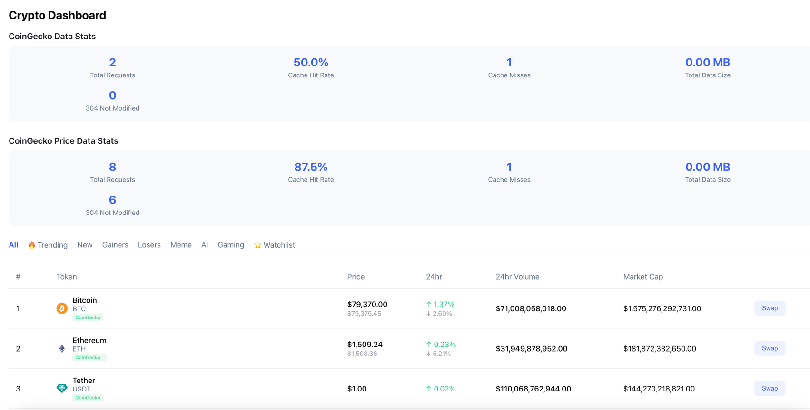

# Market Proxy

[](https://github.com/status-im/market-proxy/actions/workflows/test.yml)

A Go-based market data fetcher agent with caching and an Nginx proxy for efficient data delivery.

## Overview

This project consists of two main components:

1. **Market Fetcher**: A Go service that fetches and caches market data from CoinGecko, price updates from Binance, and provides blockchain platform-specific token lists.
2. **Nginx Proxy**: A reverse proxy that provides caching, ETag optimization, and compression for efficient delivery of market data.

## Local Development

### Prerequisites

- Docker and Docker Compose


### Configuration

1. Create a `config.yaml` file in the `market-fetcher` directory:
```yaml
coingecko_fetcher:
  update_interval_ms: 600000  # milliseconds (10 minutes)
  tokens_file: "coingecko_api_tokens.json"
  limit: 5000  # number of tokens to fetch
  request_delay_ms: 0  # delay between requests

coingecko_coinslist:
  update_interval_ms: 1800000  # milliseconds (30 minutes)
  supported_platforms:
    - ethereum
    - optimistic-ethereum  # Optimism
    - arbitrum-one         # Arbitrum
    - base
    - status
    - linea
    - blast
    - zksync
    - mantle
    - abstract
    - unichain
    - binance-smart-chain  # BSC
    - polygon-pos          # Polygon
```

2. (Optional) Create `coingecko_api_tokens.json` in the `secrets` directory for Pro API access:
```json
{
   "api_tokens": ["your-api-key-here"], 
   "demo_api_tokens": ["demo-key"]
}
```

If you don't provide this file, the service will use the public API without authentication.

### Running Locally

Run the following command to start all services:

```bash
./start-local.sh
```

This will:
1. Create necessary configuration files if they don't exist
2. Build and start the following services:
   - **market-fetcher**: Fetches market data (port 8081)
   - **market-proxy**: Nginx proxy with caching (port 8080)
   - **market-frontend**: Test frontend application (port 3000)
3. Set up a Docker network for communication between services

### Accessing the Services

- API Proxy: http://localhost:8080
- Frontend: http://localhost:3000



## Key Features

- Market data fetching from CoinGecko with rate limit handling
- Real-time price updates via Binance WebSocket
- Blockchain platform-specific token filtering
- REST API for accessing token lists, prices

## Subprojects

### [Market Fetcher](./market-fetcher/README.md)

Go application that caches token lists from CoinGecko and price updates from Binance, providing a REST API for accessing token and price data. Also provides filtered token lists based on blockchain platforms.

### [Nginx Proxy](./nginx-proxy/README.md)

A proxy that performs caching, ETag optimization, and compression for displaying market data from market-fetcher.
