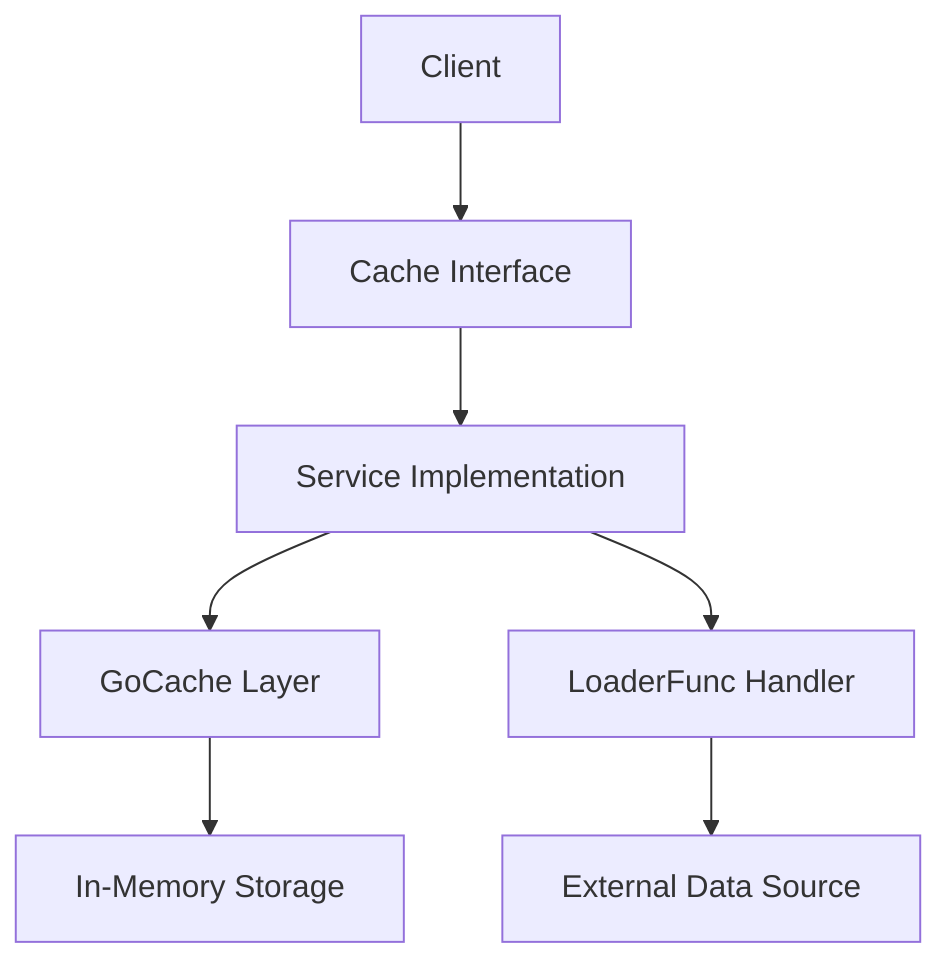

# Cache Package

Universal in-memory caching system with automatic fallback to data loader functions.

## Components



## Files

- **`cache.go`** - Cache interface and LoaderFunc type definitions
- **`service.go`** - Main cache service implementation with GetOrLoad logic
- **`gocache.go`** - Go-cache wrapper for in-memory caching
- **`config.go`** - Configuration structures for cache settings

## Configuration

```yaml
cache:
  go_cache:
    default_expiration: 5m        # Default TTL for cached items
    cleanup_interval: 10m         # Interval for cleaning expired items
```

