# Cache Package

## Description

The `cache` package implements a universal multi-level caching system. The system uses a two-tier caching architecture:

1. **Local Go-cache** - fast in-memory cache for frequently requested data
2. **Redis cache** - distributed cache for sharing data between instances

Core concept: when requesting data, the system sequentially checks the local go-cache, then Redis, and only in case of incomplete data calls the provided LoaderFunc to load missing data.

### Execution Logic

1. **Check Go Cache (Primary Path)**: First checks the local in-memory cache - in most cases data is already available and returned instantly
2. **Check Redis Cache**: When data is incomplete, checks Redis
3. **Call LoaderFunc**: When data is missing, calls the provided loading function
4. **Update Caches**: New data is saved to both caches
5. **Return Result**: Complete dataset is returned to the client

### GetOrLoad Parameters

- `keys` - list of keys to retrieve data for
- `loader` - function to load missing data
- `loadOnlyMissingKeys` - loading strategy:
  - `true` - load only missing keys (saves traffic)
  - `false` - when any data is missing, load all keys (ensures consistency)

## Implementation

### Service Implementation

The main implementation is provided by the `Service` struct that implements the `Cache` interface:

```go
type LoaderFunc func(missingKeys []string) (map[string][]byte, error)

type Cache interface {
    GetOrLoad(keys []string, loader LoaderFunc, loadOnlyMissingKeys bool) (map[string][]byte, error)
}

type Service struct {
    // Contains GoCache and configuration
}
```

### Basic Usage

```go
package main

import (
    "encoding/json"
    "fmt"
    "github.com/status-im/market-proxy/cache"
    "github.com/status-im/market-proxy/config"
)

func main() {
    // Load configuration
    cfg, err := config.LoadConfig("config.yaml")
    if err != nil {
        panic(err)
    }
    
    // Create cache service
    cacheService := cache.NewService(cfg.Cache)
    
    // Create a loader function for cryptocurrency prices
    priceLoader := func(missingKeys []string) (map[string][]byte, error) {
        fmt.Printf("Loading data for keys: %v\n", missingKeys)
        
        // Simulate API call
        prices := make(map[string]map[string]float64)
        for _, coinID := range missingKeys {
            prices[coinID] = map[string]float64{
                "usd": 45000.0, // Mock price
                "eur": 38000.0,
            }
        }
        
        // Serialize to bytes
        result := make(map[string][]byte)
        for coinID, priceData := range prices {
            data, _ := json.Marshal(priceData)
            result[coinID] = data
        }
        
        return result, nil
    }
    
    // First call - will load from API
    data1, err := cacheService.GetOrLoad(
        []string{"bitcoin", "ethereum"}, 
        priceLoader, 
        true, // load only missing keys
    )
    if err != nil {
        panic(err)
    }
    
    fmt.Printf("First call result: %d items\n", len(data1))
    
    // Second call - will return from cache (faster)
    data2, err := cacheService.GetOrLoad(
        []string{"bitcoin", "ethereum"}, 
        priceLoader, 
        true,
    )
    if err != nil {
        panic(err)
    }
    
    fmt.Printf("Second call result: %d items (from cache)\n", len(data2))
    
    // Mixed call - some from cache, some loaded
    data3, err := cacheService.GetOrLoad(
        []string{"bitcoin", "cardano", "solana"}, 
        priceLoader, 
        true,
    )
    if err != nil {
        panic(err)
    }
    
    fmt.Printf("Mixed call result: %d items\n", len(data3))
    
    // Check cache statistics
    stats := cacheService.Stats()
    fmt.Printf("Cache contains %d items\n", stats.GoCacheItems)
}
```

### Configuration

Configure cache in your `config.yaml`:

```yaml
cache:
  go_cache:
    enabled: true
    default_expiration: 5m    # 5 minutes
    cleanup_interval: 10m     # 10 minutes
  redis:
    enabled: false            # Not implemented yet
    address: "localhost:6379"
    password: ""
    database: 0
    default_expiration: 10m
    key_prefix: "market-proxy:"
```

## Component Diagram


## Sequence Diagram


## Detailed Algorithm Diagram

```mermaid
flowchart TD
    Start([GetOrLoad Request]) --> CheckGoCache{Check Go Cache}
    
    %% Primary path - HIT ALL DATA
    CheckGoCache -->|✅ HIT - ALL DATA| ReturnDataFast[🚀 Return Complete Data<br/>FASTEST PATH]
    
    %% Fallback paths
    CheckGoCache -->|❌ Miss/Partial| CheckRedis{Check Redis Cache}
    
    CheckRedis -->|✅ Hit - Complete Missing| MergeAndUpdate1[Merge Data & Update Go Cache]
    CheckRedis -->|❌ Miss/Partial| CheckLoadPolicy{loadOnlyMissingKeys?}
    
    CheckLoadPolicy -->|true| LoadMissing[LoaderFunc with<br/>missing keys only]
    CheckLoadPolicy -->|false| LoadAll[LoaderFunc with<br/>all keys]
    
    LoadMissing --> UpdateBothCaches1[Update Go & Redis Caches]
    LoadAll --> UpdateBothCaches2[Update Go & Redis Caches]
    
    UpdateBothCaches1 --> ReturnMerged[Return Merged Data]
    UpdateBothCaches2 --> ReturnComplete[Return Complete Data]
    MergeAndUpdate1 --> ReturnFromRedis[Return Merged Data]
    
    %% Styles for highlighting primary path
    style Start fill:#e3f2fd
    style ReturnDataFast fill:#4caf50,stroke:#2e7d32,stroke-width:4px,color:#fff
    style CheckGoCache fill:#f3e5f5,stroke:#2e7d32,stroke-width:3px
    style ReturnComplete fill:#e8f5e8
    style ReturnMerged fill:#e8f5e8
    style ReturnFromRedis fill:#e8f5e8
    style CheckRedis fill:#f3e5f5
    style CheckLoadPolicy fill:#fce4ec
```



## Architecture Benefits

- **Universality** - works with any data types through LoaderFunc
- **High Performance** - local cache provides minimal latency
- **Scalability** - Redis enables cache sharing between instances
- **Fault Tolerance** - multi-level system with fallback to LoaderFunc
- **Flexibility** - configurable data loading strategies
- **Easy Integration** - minimal requirements for external systems
- **Simplicity** - clean, focused interface with single responsibility

