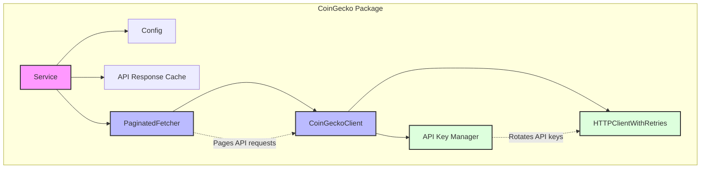

# CoinGecko Package

This package implements a client for fetching cryptocurrency data from the CoinGecko API.

## Package Structure

## Core Components

- **Service**: Main entry point that receives configuration and tokens, maintains a cache of API responses
- **PaginatedFetcher**: Handles pagination of large requests by breaking them into smaller page requests
- **CoinGeckoClient**: Manages the communication with the CoinGecko API
- **HTTPClientWithRetries**: Implements retry logic for API requests
- **API Key Manager**: Rotates through available API keys to avoid rate limiting 