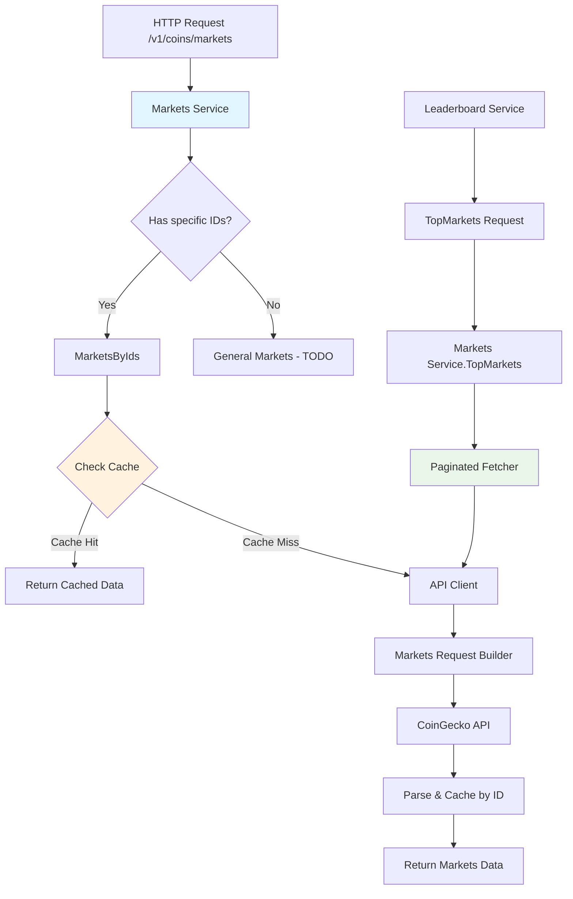

# CoinGecko Markets Package

## Architecture Overview
The `coingecko_markets` package provides CoinGecko-compatible `/v1/coins/markets` endpoint with intelligent caching, pagination support, and API client with retry mechanisms.

## Files Description

### Core Components
- **`service.go`** - Main service with cache-first strategy, handles Markets() and TopMarkets() requests
- **`api.go`** - HTTP client for CoinGecko API(`coins/markets`) with retry logic and multiple API key support
- **`paginated_fetcher.go`** - Handles paginated data fetching from CoinGecko
- **`types.go`** - Data structures for CoinGecko markets API response format
- **`utils.go`** - Helper functions for cache key generation and data manipulation
- **`markets_request_builder.go`** - Fluent builder for constructing CoinGecko API requests

## Request Flow Architecture



## Usage Examples

```go
// Get markets for specific token IDs
params := coingecko_common.MarketsParams{
    IDs: []string{"bitcoin", "ethereum"},
    Currency: "usd",
}
markets, err := service.Markets(params)

// Get top N markets for leaderboard
topMarkets, err := service.TopMarkets(100, "usd")
``` 