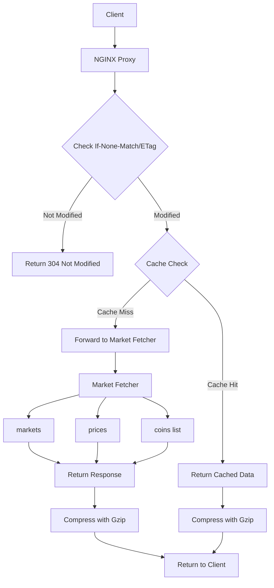

# Nginx Market Proxy

A proxy that performs caching, ETag optimization, and compression for displaying market data from market-fetcher.

## How It Works



The nginx market proxy handles requests through the following process:

1. Receives HTTP GET requests for market data:
   - `/v1/simple/price` - CoinGecko-compatible simple price endpoint
   - `/v1/coins/{coin_id}/market_chart` - CoinGecko-compatible historical price data with intelligent caching
   - `/v1/leaderboard/markets` - returns token market data from CoinGecko
   - `/v1/leaderboard/prices` - returns price data from Binance
   - `/v1/coins/list` - returns a list of tokens with their supported blockchain platforms
   - `/health` - returns service health status
2. Validates the request format
3. Checks if the requested data is available in the cache
4. For cached data:
   - Returns the cached data with appropriate headers
   - If data is not available, returns a 503 error
5. Periodically reloads market data configuration to maintain up-to-date information

## Local Development

run [../start-local.sh](../start-local.sh) to start the proxy locally.

see response format in [../market-fetcher/README.md](../market-fetcher/README.md) for more details.

## Request Format

Requests must be in one of the following formats:
```
GET /v1/simple/price?ids={coin_ids}&vs_currencies={currencies}
GET /v1/coins/{coin_id}/market_chart?days={days}&interval={interval}
GET /v1/leaderboard/markets
GET /v1/leaderboard/prices
GET /v1/coins/list
```

Examples:
```bash
# Get simple price data (CoinGecko-compatible)
curl -X GET "http://localhost:8080/v1/simple/price?ids=bitcoin,ethereum&vs_currencies=usd,eur"

# Get market chart data with intelligent caching
curl -X GET "http://localhost:8080/v1/coins/bitcoin/market_chart?days=7&interval=daily"

# Get market data
curl -X GET http://localhost:8080/v1/leaderboard/markets

# Get price data
curl -X GET http://localhost:8080/v1/leaderboard/prices

# Get tokens by platform (CoinGecko-compatible)
curl -X GET http://localhost:8080/v1/coins/list
```

## Caching

The proxy implements caching with the following features:
1. ETag-based caching to reduce bandwidth
2. Configurable cache TTL (Time To Live)
3. Automatic cache invalidation when new data is available

## Authentication

The proxy can be configured to require HTTP basic authentication. Credentials are stored in `.htpasswd`. 